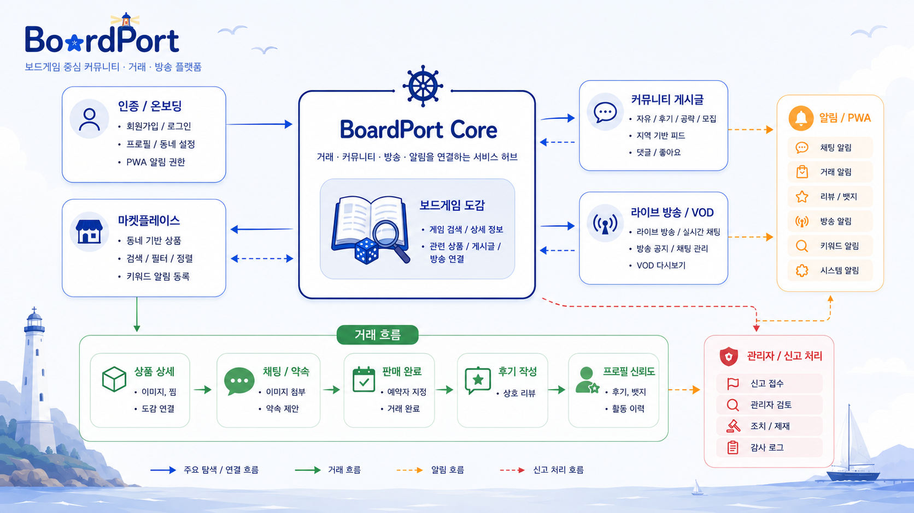
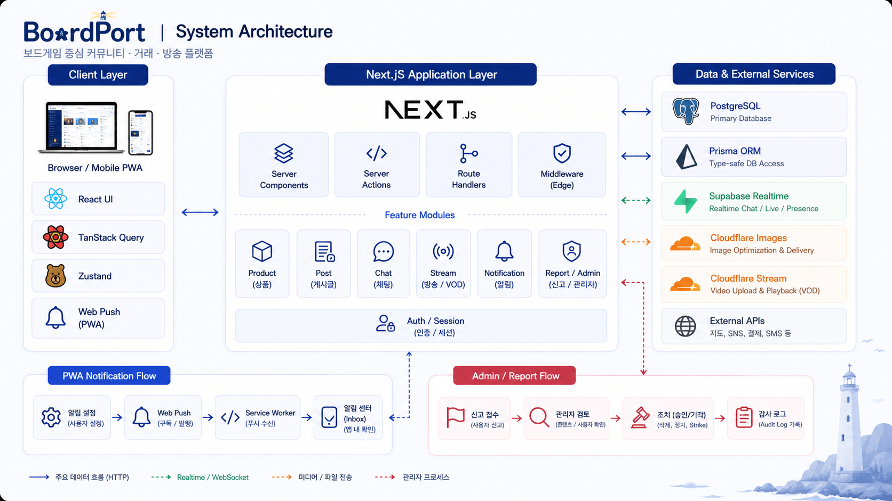

# BoardPort

> 보드게임 정보 탐색부터 중고거래, 직거래 약속, 커뮤니티, 라이브/VOD까지 연결한 1인 풀스택 웹 서비스

[서비스 체험](https://boardport.life) · [전체 데모](#demo) · [기술 문서](./docs/README.md) · [Releases](https://github.com/DoHeonLim/BoardPort/releases)

BoardPort는 범용 중고거래 서비스에서 분리되기 쉬운 **상품 탐색 → 문의 → 직거래 약속 → 거래 후기 → 플레이 콘텐츠**를 하나의 흐름으로 연결한 모바일 퍼스트 웹 애플리케이션입니다.

상품, 커뮤니티, 방송, 채팅, 알림, 관리자 기능은 각 도메인의 책임에 따라 분리하고, **보드게임 도감**을 상품·게시글·방송을 잇는 공통 맥락으로 사용했습니다.

## 30초 요약

| 항목             | 내용                                                                                                             |
| ---------------- | ---------------------------------------------------------------------------------------------------------------- |
| 개발 형태        | 1인 기획·설계·개발·배포·운영                                                                                     |
| 개발 기간        | 2024.10 - 2026.07                                                                                                |
| 핵심 사용자 흐름 | 도감 탐색 → 상품/콘텐츠 확인 → 채팅·약속 → 거래·후기 → 라이브/VOD                                                |
| 담당 범위        | Frontend, Backend, Data Modeling, Realtime, Media, PWA, Admin, CI/CD                                             |
| 핵심 스택        | Next.js 14 App Router, React 18, TypeScript, Prisma 7, PostgreSQL, TanStack Query v5, Zustand, Supabase Realtime |

## Key Engineering Problems

기능 수보다 **도메인 사이의 상태 정합성**, **비동기 이벤트의 순서**, **App Router의 탐색 문맥**을 안정화하는 데 집중했습니다.

| 문제                                                          | 설계 판단                                                                                                                              | 결과 및 근거                                                                                                                                                                  |
| ------------------------------------------------------------- | -------------------------------------------------------------------------------------------------------------------------------------- | ----------------------------------------------------------------------------------------------------------------------------------------------------------------------------- |
| 채팅 약속 수락과 상품 예약 상태가 서로 어긋날 수 있음         | 약속 수락, 상품 예약 전환, 다른 대기 약속 취소, 시스템 메시지를 하나의 transaction으로 처리하고 조건부 `updateMany`로 동시 수락을 방어 | 약속과 상품이 하나의 확정 상태로 전환되도록 만들고 경쟁 요청의 중복 수락을 차단 — [상세 문서](./docs/troubleshooting/troubleshooting-appointment-atomic-transition.md)        |
| Server State, UI State, Realtime 이벤트의 갱신 책임이 섞임    | Zustand는 UI 상태, TanStack Query는 서버 상태로 분리하고 Realtime은 화면 성격에 따라 payload 즉시 반영 또는 DB 재검증 신호로 처리      | 메시지·알림의 즉시성을 유지하면서 목록·미읽음 수·방송 상태는 DB의 확정 상태로 수렴 — [상세 문서](./docs/architecture/case-study-state-management-modernization.md)            |
| 모달 상세, 일반 상세, 수정 화면의 URL과 복귀 문맥이 충돌함    | Intercepting Route와 일반 상세를 함께 지원하고 `returnTo`, `flow`, 1회성 refresh flag로 문맥을 분리                                    | 공유 가능한 상세 URL을 유지하면서 목록·모달·수정 화면 사이의 뒤로가기와 최신화 흐름을 안정화 — [상세 문서](./docs/troubleshooting/troubleshooting-product-modal-routing.md)   |
| Cloudflare 인코딩 이벤트와 게시글 저장의 순서가 보장되지 않음 | READY 선도착을 허용하고 실제 게시글 연결 전까지 `draftKey`를 보존하며 실패 이벤트를 `FAILED`로 수렴                                    | 이벤트 순서가 바뀌어도 영상을 연결하고 `PROCESSING` 상태가 무기한 고착되는 문제를 방지 — [상세 문서](./docs/troubleshooting/troubleshooting-post-video-cloudflare-webhook.md) |

## Demo

- Production: [https://boardport.life](https://boardport.life)
- Demo Password: 모든 데모 계정 공통 `BoardPort!234`

| Role      | Email                         | What to Check                          |
| --------- | ----------------------------- | -------------------------------------- |
| Main User | `buyer_casual@boardport.life` | 상품 탐색, 찜, 채팅, 거래/후기, 프로필 |
| Seller    | `seller_euro@boardport.life`  | 판매 상품, 예약/판매 상태, 거래 관리   |
| Streamer  | `rules_helper@boardport.life` | 라이브 방송, VOD, 도감/게시글 연결     |
| Admin     | `admin@boardport.life`        | 신고 처리, 제재, 감사 로그             |

<!-- markdownlint-disable MD033 -->

### Overview

BoardPort의 주요 도메인과 사용자 흐름을 한 번에 확인할 수 있는 전체 데모입니다.

<video src="https://github.com/user-attachments/assets/ca062392-83cf-47c9-8903-70a098b19f41" controls muted playsinline width="100%"></video>

## Feature Flow

거래, 커뮤니티, 방송, 채팅, 알림, 관리자 기능은 도메인별 책임에 따라 분리하고, 보드게임 도감이 상품·게시글·방송을 연결하는 기준 축이 됩니다.



## Core User Journeys

| 흐름                        | 대표 기능                                                                            |
| --------------------------- | ------------------------------------------------------------------------------------ |
| 보드게임 탐색 → 상품 거래   | 도감 검색, 지역/조건 필터, 상품 상세, 찜, 최근 본 상품, 거래 상태 전이               |
| 상품 문의 → 직거래 확정     | 상품 기반 1:1 채팅, 이미지 첨부, 카카오맵 장소 제안, 약속 수락/취소, 상품 예약 연동  |
| 게임 정보 → 커뮤니티 콘텐츠 | 도감 기반 관련 상품·게시글·방송 연결, 댓글/대댓글, 이미지·동영상·임베드 블록         |
| 라이브 방송 → VOD 아카이브  | Cloudflare Stream 기반 라이브, 공개/팔로워/비공개 접근 제어, VOD, 좋아요·댓글·조회수 |
| 사용자 활동 → 운영 관리     | 프로필, 팔로우, 후기, 뱃지, In-App/PWA 알림, 신고·제재·감사 로그                     |

## Feature Tour

<details>
<summary><strong>기능별 데모 영상 펼쳐보기</strong></summary>

### Auth & Onboarding

회원가입 이후 온보딩과 초기 프로필 진입까지 이어지는 첫 사용 흐름입니다.

<video src="https://github.com/user-attachments/assets/383eda82-e658-44d1-8951-4cfbf5d5fe7a" controls muted playsinline width="100%"></video>

### Marketplace Discovery

지역 변경, 검색, 분류, 상세 필터, 키워드 알림 등록까지 이어지는 상품 탐색 흐름입니다.

<video src="https://github.com/user-attachments/assets/ac806637-ee7d-4a19-8ae7-87172ce7a744" controls muted playsinline width="100%"></video>

### Product Trade

상품 상세에서 도감 정보와 이미지 확대를 확인한 뒤, 채팅과 약속 조율로 이어지는 거래 흐름입니다.

<video src="https://github.com/user-attachments/assets/aa37595e-ae46-4cad-a8bc-56a12e4bb417" controls muted playsinline width="100%"></video>

### Chat & Appointment

상품 기반 채팅에서 이미지 첨부, 직거래 약속 제안, 상대방 수락까지 이어지는 거래 조율 흐름입니다.

<video src="https://github.com/user-attachments/assets/fdf8b9ce-c013-438d-9d5f-68a6b2bdbf19" controls muted playsinline width="100%"></video>

### Live & VOD

프로필 방송국에서 라이브로 진입해 채팅과 공지를 확인하고, VOD 목록까지 이어지는 방송 흐름입니다.

<video src="https://github.com/user-attachments/assets/7c72c5ce-9e0e-4a1e-9cfd-5289557abca3" controls muted playsinline width="100%"></video>

### BoardGame Catalog

보드게임 도감 검색과 상세 정보, 관련 상품/게시글/방송 연결 흐름입니다.

<video src="https://github.com/user-attachments/assets/3ac2f8ce-146c-4fc2-a3af-33236cb3b9e7" controls muted playsinline width="100%"></video>

### Profile Activity

프로필에서 찜, 판매/구매 내역, 후기, 뱃지, 방송 활동을 확인하는 사용자 활동 허브입니다.

<video src="https://github.com/user-attachments/assets/90b3c5dd-934c-428b-9bc9-94f44de3731c" controls muted playsinline width="100%"></video>

### Admin Console

신고 처리, 제재, 감사 로그까지 이어지는 관리자 운영 흐름입니다.

<video src="https://github.com/user-attachments/assets/06ae878a-5123-42d4-ab05-181cdfcf1971" controls muted playsinline width="100%"></video>

</details>

## System Architecture

초기 데이터는 Server Component에서 service 계층 또는 세션·viewer 정보를 주입하는 조회용 Server Action을 서버에서 호출해 준비합니다. 주요 목록의 Client queryFn은 Route Handler fetch를 사용하고, 채팅 메시지·리뷰·팔로우·검색 기록 등 일부 기존 조회와 사용자 변경 작업은 Server Action을 유지합니다. Realtime 이벤트는 화면 특성에 따라 payload를 즉시 반영하거나 DB의 확정 상태를 재검증하는 신호로 사용하고, 외부 웹훅은 비동기 처리 결과를 DB 상태 전이로 반영합니다.



## Engineering Decisions

| 영역             | 선택                                                                                                 | 이유                                                                                              |
| ---------------- | ---------------------------------------------------------------------------------------------------- | ------------------------------------------------------------------------------------------------- |
| 코드 구조        | `features/*` 중심의 Feature-first Architecture                                                       | 파일 종류보다 상품, 게시글, 채팅, 방송 등 도메인 책임을 기준으로 코드를 탐색하고 변경 범위를 제한 |
| 데이터 조회/변경 | Server Component service/조회용 Server Action, 주요 목록 Route Handler fetch, mutation Server Action | App Router의 실행 위치와 사용자 의도를 구분하고 주요 목록의 클라이언트 재조회 경로를 명확히 분리  |
| 상태 관리        | TanStack Query + Query Key Factory / Zustand Store Factory                                           | 서버 캐시와 UI 상태를 분리하고 SSR 요청 사이의 전역 store 공유 위험을 축소                        |
| 실시간 동기화    | Supabase Realtime payload 즉시 반영 + query invalidate/refetch/refresh                               | 채팅·알림은 즉시 반영하고 목록·미읽음 수·방송 상태는 DB의 확정 상태로 재검증                      |
| 캐시·개인화      | 공용 데이터 캐시와 사용자별 상태를 분리                                                              | 상품·게시글 같은 공용 데이터의 캐시 이점을 유지하면서 좋아요·팔로우·읽음·접근 권한의 오염을 방지  |
| 미디어 처리      | Cloudflare Images Direct Upload / Stream webhook 상태 전이                                           | 대용량 미디어 처리를 외부 서비스에 위임하되 업로드 draft와 앱 내부 도메인 상태를 명시적으로 연결  |

## Quality & Delivery

| 구분               | 검증 범위                                                                                           |
| ------------------ | --------------------------------------------------------------------------------------------------- |
| Unit / Integration | Vitest로 입력 스키마, 상태 전이, callback URL, query cache/cursor 보정, 알림·접근 정책 검증         |
| E2E                | Playwright로 인증/보호 경로, 상품·게시글 CRUD, 채팅 약속 수락, 도감/VOD 진입, 관리자 신고 처리 검증 |
| CI                 | GitHub Actions에서 `test`, type check, lint, build와 Playwright Chromium workflow 실행              |
| CD                 | `master`를 production branch로 두고 Vercel Git 연동으로 배포                                        |

- [테스트 전략](./docs/operations/testing-strategy.md)
- [CI/CD Workflow](./docs/operations/ci-cd-workflows.md)

## Tech Stack

| Category           | Technologies                                                                                          |
| ------------------ | ----------------------------------------------------------------------------------------------------- |
| Frontend           | Next.js 14 App Router, React 18, TypeScript, Tailwind CSS, Framer Motion, Floating UI, Apache ECharts |
| State              | TanStack Query v5, Zustand                                                                            |
| Backend / Data     | Server Actions, Route Handlers, Prisma 7, PostgreSQL, iron-session                                    |
| Realtime / Media   | Supabase Realtime, Cloudflare Stream, Cloudflare Images                                               |
| PWA / Notification | next-pwa, Web Push API, Service Worker                                                                |
| External APIs      | Kakao OAuth, Kakao Maps/Local API, CoolSMS, Resend                                                    |
| Test / Delivery    | Vitest, Playwright, GitHub Actions, Vercel                                                            |

## Recommended Reading

README에서는 결과를 빠르게 확인하고, 아래 문서에서는 문제의 원인과 선택한 트레이드오프를 확인할 수 있습니다.

1. [Project Overview](./docs/architecture/boardport-project-overview.md)
2. [State Management Modernization](./docs/architecture/case-study-state-management-modernization.md)
3. [Appointment Atomic Transition](./docs/troubleshooting/troubleshooting-appointment-atomic-transition.md)
4. [Product Modal Routing](./docs/troubleshooting/troubleshooting-product-modal-routing.md)
5. [Post Video Cloudflare Webhook](./docs/troubleshooting/troubleshooting-post-video-cloudflare-webhook.md)

전체 문서 목록은 [docs/README.md](./docs/README.md)에서 확인할 수 있습니다.

## Project Structure

```text
app/          App Router 페이지, 레이아웃, 메타 라우트, Route Handler
components/   전역 레이아웃 및 공통 UI 컴포넌트
docs/         공개용 설계, 운영, 트러블슈팅 문서
features/     도메인별 비즈니스 로직과 UI
hooks/        공용 hooks
lib/          세션, query keys, store, 공통 유틸
prisma/       Prisma schema, seed, migration
tests/        Playwright E2E 시나리오
```

## Local Development

<details>
<summary><strong>로컬 실행 방법 펼쳐보기</strong></summary>

1. 의존성을 설치합니다.

```bash
npm install
```

1. `.env.example`을 참고해 `.env.local`에 필요한 환경 변수를 설정합니다.

1. 로컬 또는 개발 DB에 Prisma 마이그레이션을 적용합니다.

```bash
npx prisma migrate dev
```

1. 기본 데이터가 필요하면 seed를 실행합니다.

```bash
npx prisma db seed
```

1. 개발 서버를 실행합니다.

```bash
npm run dev
```

외부 연동이 필요한 로그인, SMS, 이메일, 지도, 이미지, 방송, 푸시 알림 기능은 해당 서비스의 환경 변수가 설정되어야 정상 동작합니다.

### 주요 명령어

```bash
npm run dev
npm run test
npx tsc --noEmit
npm run lint
npm run build
npm run test:e2e
```

### 환경 변수

실제 값은 `.env` 또는 Vercel Environment Variables에 설정하고 저장소에는 커밋하지 않습니다.

| Group          | Variables                                                                                                                                                                                       |
| -------------- | ----------------------------------------------------------------------------------------------------------------------------------------------------------------------------------------------- |
| App / Security | `NEXT_PUBLIC_APP_URL`, `COOKIE_PASSWORD`, `RATE_LIMIT_SALT`, `CRON_SECRET`                                                                                                                      |
| Database       | `DATABASE_URL`, `DIRECT_URL`                                                                                                                                                                    |
| Supabase       | `NEXT_PUBLIC_SUPABASE_URL`, `NEXT_PUBLIC_SUPABASE_PUBLIC_KEY`                                                                                                                                   |
| OAuth          | `GITHUB_CLIENT_ID`, `GITHUB_CLIENT_SECRET`, `KAKAO_CLIENT_ID`, `KAKAO_CLIENT_SECRET`, `KAKAO_REDIRECT_URI`                                                                                      |
| SMS            | `COOLSMS_API_KEY`, `COOLSMS_API_SECRET`, `COOLSMS_SENDER_NUMBER`                                                                                                                                |
| Email          | `RESEND_API_KEY`                                                                                                                                                                                |
| Cloudflare     | `NEXT_PUBLIC_CLOUDFLARE_ACCOUNT_HASH`, `NEXT_PUBLIC_CLOUDFLARE_STREAM_DOMAIN`, `CLOUDFLARE_ACCOUNT_ID`, `CLOUDFLARE_API_TOKEN`, `CLOUDFLARE_WEBHOOK_SECRET`, `CLOUDFLARE_STREAM_WEBHOOK_SECRET` |
| Push           | `NEXT_PUBLIC_VAPID_PUBLIC_KEY`, `VAPID_PRIVATE_KEY`                                                                                                                                             |
| Maps           | `NEXT_PUBLIC_KAKAO_MAP_API_KEY`                                                                                                                                                                 |

</details>

<!-- markdownlint-enable MD033 -->
